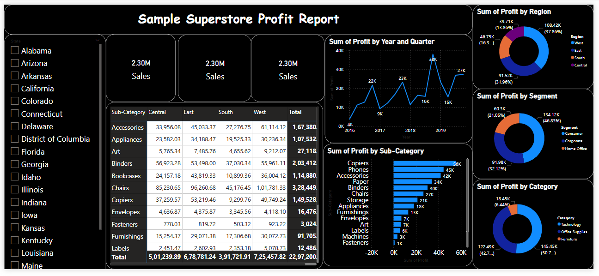

# 📊 Superstore Profit Analysis Dashboard

This project contains a Power BI dashboard built using the **Sample Superstore dataset**, designed to provide actionable insights into sales and profitability across different market segments, regions, and product categories.

## 🔍 Dashboard Overview

The dashboard answers key business questions such as:

- Which regions and segments are most profitable?
- What categories or sub-categories are underperforming?
- How does discount affect profitability?
- What are the monthly trends in sales and profit?

## 📌 Key Features

- **Interactive filters** by Region, Segment, and Date
- **Profit and Sales analysis** by Category and Sub-Category
- **Dynamic visuals** (bar charts, line graphs)
- Highlights **top and bottom performers**
- Identifies areas of concern (like high-discount/low-profit products)

  ## 📈 Dashboard

## 📊 Dashboard Insights
**This dashboard provides a comprehensive overview of profit performance across different dimensions using the Sample Superstore dataset. Key insights include:**

- Total Sales: Over 2.30M in sales achieved across the dataset.

- Profit by Year: Profit saw significant growth in 2017 and 2018, with a slight dip in 2019.

- Most Profitable Region: The West region leads in profitability with over 108.42K in profit (~38% of total).

- Top Segment: Corporate contributes the highest profit among segments, making up ~47%.

- Most Profitable Category: Furniture edges slightly over other categories, contributing about 50.7% of total profit.

**Top Sub-Categories:**

- Copiers, Phones, and Accessories are the highest profit-generating sub-categories.

- Tables and Bookcases show relatively lower profits or potential losses.

 **Regional Profit Distribution:**

- The Central and South regions lag in profitability compared to East and West.

- State-wise Filter: The slicer enables users to filter metrics based on selected states for deeper regional analysis.

- Profit Trend: The line chart clearly illustrates quarterly profit fluctuations and seasonal patterns across years.

  ---
